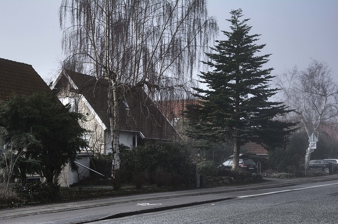
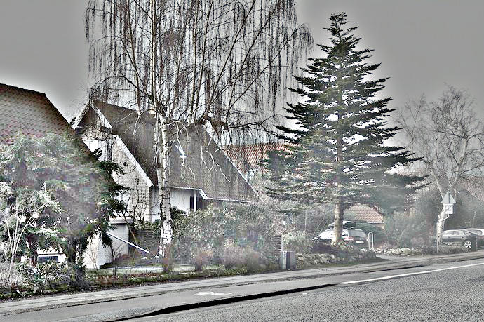
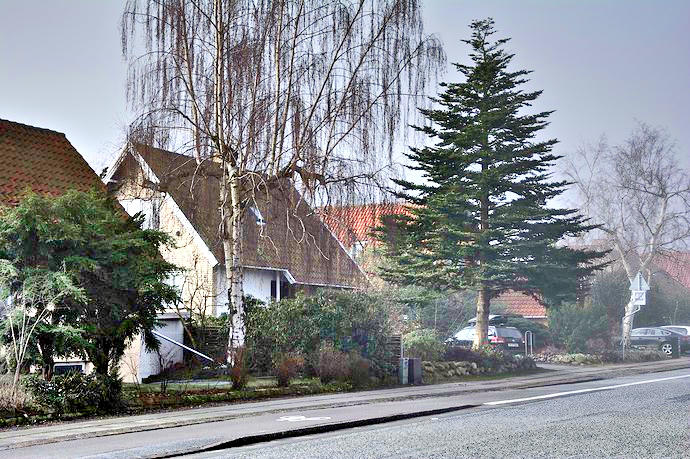
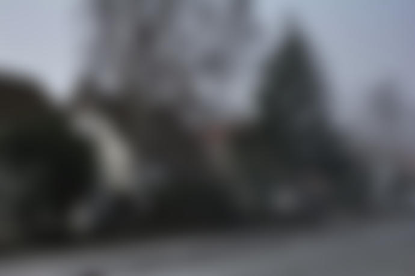
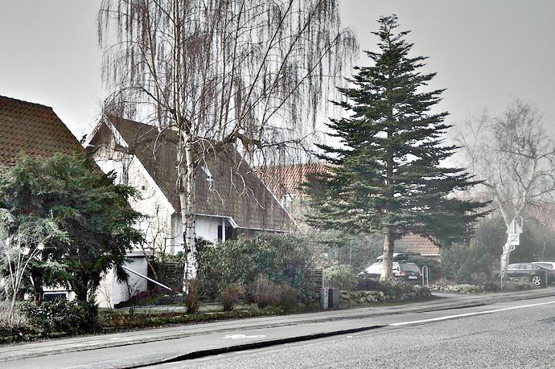

# Retinex CLI

Reference implementation of single-scale and multi-scale Retinex image enhancement with color restoration (MSRCR).

## Prerequisites

- Rust toolchain (`rustup` recommended)

## Build

```bash
cargo build --release
```

## Usage

```bash
retinex --help
```

### Basic Examples

Single scale with default sigma (produces grayscale reflectance):

```bash
cargo run --release -- images/house.jpg output.jpg
```

Multi scale with custom sigmas:

```bash
cargo run --release -- images/house.jpg msr.jpg --mode multi --sigmas 15,80,250
```

### Multi-Scale Retinex with Color Restoration (MSR)

The recommended approach for best results - combines multiple scales with color restoration:

```bash
cargo run --release -- images/house.jpg msr.jpg \
  --mode multi \
  --sigmas 15,80,250 \
  --color-restore
```

This produces natural-looking results with enhanced local details and corrected global illumination.

### Color Restoration (MSRCR)

The basic Retinex algorithm produces grayscale output because it processes each color channel independently and normalizes them separately. This destroys the color ratios.

Enable color restoration to preserve colors:

```bash
cargo run --release -- images/house.jpg color.jpg --color-restore
```

### Viewing Components Separately

Save the estimated illumination (lighting component):

```bash
cargo run --release -- images/house.jpg output.jpg --illumination illumination.jpg
```

Save the raw reflectance (before color restoration):

```bash
cargo run --release -- images/house.jpg output.jpg --reflectance reflectance.jpg
```

Save all components at once:

```bash
cargo run --release -- images/house.jpg result.jpg \
  --mode multi \
  --sigmas 15,80,250 \
  --color-restore \
  --illumination light.jpg \
  --reflectance refl.jpg
```

## Example Results

### Original Input


### Single-Scale Retinex (Grayscale)
Basic Retinex without color restoration produces high-contrast grayscale:

```bash
retinex images/house.jpg readme/house_basic.jpg --mode single --sigmas 15
```



### Multi-Scale Retinex with Color Restoration (MSR)
The recommended approach using multiple scales with color restoration:

```bash
retinex images/house.jpg readme/house_msr.jpg \
  --mode multi \
  --sigmas 15,80,250 \
  --color-restore
```



### Illumination Component
The estimated lighting (slowly varying, blurred version of input):

```bash
retinex images/house.jpg output.jpg --illumination readme/house_illumination.jpg
```



### Reflectance Component
The extracted reflectance (high-contrast, object colors without lighting):

```bash
retinex images/house.jpg output.jpg --reflectance readme/house_reflectance.jpg
```



## Why Basic Retinex Looks Grayscale

The basic Retinex formula computes:

```
R = log(I) - log(G_σ * I)
```

When applied independently to each RGB channel and then normalized per-channel, the relative color ratios are lost. All three channels end up with similar values because:

1. Each channel's log-response is normalized to [0, 255] independently
2. The min/max stretching destroys the original color proportions
3. The result appears bright and desaturated (grayscale)

## Color Restoration (MSRCR)

MSRCR (Multi-Scale Retinex with Color Restoration) fixes this by applying a color restoration factor based on the original image's color ratios:

```
R_final = R_msr × (I_channel / (I_r + I_g + I_b)) × 3
```

The factor of 3 normalizes the weights (since the three ratios sum to 1). This preserves the original hue while applying the Retinex contrast enhancement.

## Algorithm Overview

Given an observed image `I`:

```
I(x,y) = R(x,y) × L(x,y)
```

- `R` is the reflectance (desired result - object colors)
- `L` is illumination (slowly varying lighting - estimated via Gaussian blur)

Single-scale Retinex:

```
R = log(I + ε) - log((G_σ × I) + ε)
```

Multi-scale Retinex averages multiple scales to balance local and global contrast.

## Output Files

- **Main output** (`output.jpg`): The processed result
  - Without `--color-restore`: Normalized reflectance (grayscale, high contrast)
  - With `--color-restore`: Color-corrected result with preserved hues

- **Illumination** (`--illumination`): The estimated lighting component
  - Shows the slowly-varying illumination that was subtracted
  - Blurred version of the original image

- **Reflectance** (`--reflectance`): The raw reflectance before color restoration
  - Shows what the algorithm extracted as "object colors"
  - High-contrast grayscale image

## Parameters

- `--mode`: `single` or `multi` - use multiple scales for better results
- `--sigmas`: Comma-separated Gaussian blur radii (e.g., `15,80,250`)
  - Small values (5-30): Enhance local details
  - Large values (100-300): Correct global illumination
- `--color-restore`: Enable MSRCR color restoration
- `--illumination <path>`: Save illumination component to file
- `--reflectance <path>`: Save raw reflectance to file

## Technical Details

### Normalization

The reflectance output uses percentile-based clipping (2nd to 98th percentile) to handle outliers in the log-domain values. This prevents extreme values from compressing the visible dynamic range.

### Color Restoration Formula

```rust
// For each pixel and channel:
let sum = r + g + b;
let color_factor = (original[channel] / sum) * 3.0;
let output = reflectance[channel] * color_factor * 255.0;
```

The color factor reweights each channel based on its proportion in the original image, restoring the original color balance.
